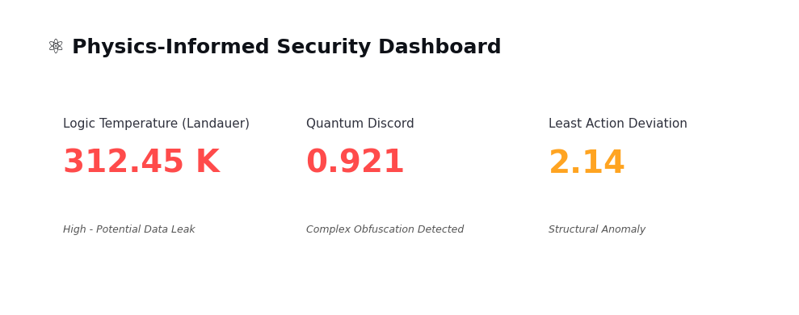
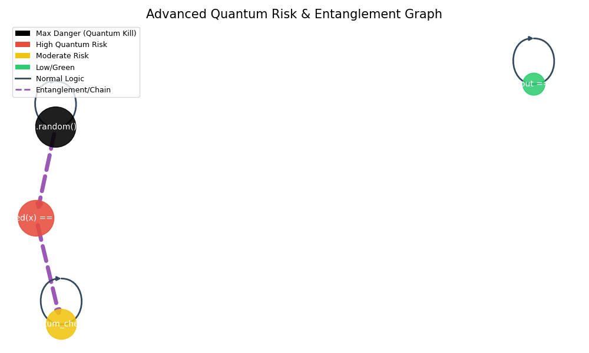

# ⚛️ Q-Trace Pro — The Private Quantum Auditor

[](https://opensource.org/licenses/MIT)
[](https://github.com/dineshk/q-trace)
[](https://cirq.readthedocs.io)

**Local-Native | Symbolic Verification | Thermodynamics | Rust Core**

Q-Trace Pro is a revolutionary security instrument that mathematically proves the safety of Python code. By treating code as a physical system, it detects "quantum-native" adversarial threats—probabilistic bombs, entangled logic, and steganography—using **Von Neumann Entropy**, **Landauer's Principle**, and **Z3 Symbolic Execution**.

Unlike classical tools that guess, Q-Trace Pro **proves**. Unlike cloud tools that leak, Q-Trace Pro stays **private**.

---

## 📸 Visual Dashboard

| **Physics-Informed Metrics** | **Entanglement Graph** |
|:---:|:---:|
|  |  |
| *Monitor Logic Temperature & Discord* | *Visualize Cross-Function Threats* |

---

## 🚀 Revolutionary Architecture

### 1. Formal Verification (White-Box Proof)
The **Symbolic Engine** converts your Python logic into mathematical constraints and solves them using the **Z3 Theorem Prover**.
*   **Logic:** $\text{Path}_{\text{safe}} = \neg (\text{Logic}_{\text{Python}} \wedge \text{State}_{\text{Malicious}})$
*   **Result:** Definitive proof of safety. No false negatives.

### 2. Thermodynamics of Security
We apply laws of physics to code analysis:
*   **Landauer’s Limit:** $Q \ge kT \ln 2 \cdot \Delta I$. Detects hidden data exfiltration (high information loss without computation).
*   **Quantum Discord:** $\delta(A:B) = I - J$. Identifies obfuscated logic hiding in non-classical correlations.
*   **Hamiltonian Action:** $S = \int (T - V) dt$. Flags "unphysical" code paths that deviate from the Principle of Least Action (Backdoors).

### 3. Rust-Powered Speed
Includes a **Compiled Rust Core** (`qtrace_core`) for scanning massive codebases (100k+ LOC) in milliseconds.
*   **Hybrid Analysis:** Python handles the logic, Rust handles the pattern matching.
*   **Fallback:** Automatically degrades to Python heuristics if Rust is not compiled.

---

## 🛡️ Features at a Glance

*   **🔍 Signature-Less Detection:** Uses **Graph Isomorphism** to match code structure against known malicious templates (Logic Bombs).
*   **🧠 Adversarial ML:** Built-in **One-Class SVM** detects anomalies in quantum circuit features.
*   **📦 Quantum Sandbox:** "Safe Run" mode executes probabilistic logic in a controlled simulation before deployment.
*   **🔒 Air-Gapped:** Zero data leaves your machine. 100% Local.

---

## 💡 Quick Start

### Installation
```bash
# 1. Clone the repository
git clone https://github.com/dineshk/q-trace.git
cd q-trace

# 2. Install dependencies
pip install -r qtrace-pro/requirements.txt
pip install z3-solver
```

### Running the Auditor
```bash
streamlit run qtrace-pro/main.py
```

### Usage Workflow
1.  **Upload:** Drop your `.py` file into the secure zone.
2.  **Audit:** Click **"Perform Local Quantum Audit"**.
3.  **Analyze:**
    *   Review the **Symbolic Proof** (Green = Safe).
    *   Check **Logic Temperature** (High = Leak).
    *   Inspect **Entanglement Graph** for coupled threats.
4.  **Report:** Download the JSON/SARIF audit report.

---

## 🛠️ Performance Tuning (Rust)
To enable the high-performance engine:
```bash
cd qtrace-pro/rust_core
maturin develop
```

---

## ⚠️ Legal / Disclaimer
This tool is for **defensive security research** only. Do not use it to analyze or deploy real-world malware, ransomware, or illegal payloads. You are solely responsible for how you use this tool.

---

## 🧑‍💻 Credits
**Built by Dinesh K**
*   **Core:** Cirq, Z3 Solver, Rust (PyO3)
*   **Viz:** Streamlit, NetworkX, Matplotlib
*   **ML:** Scikit-Learn (OneClassSVM)
